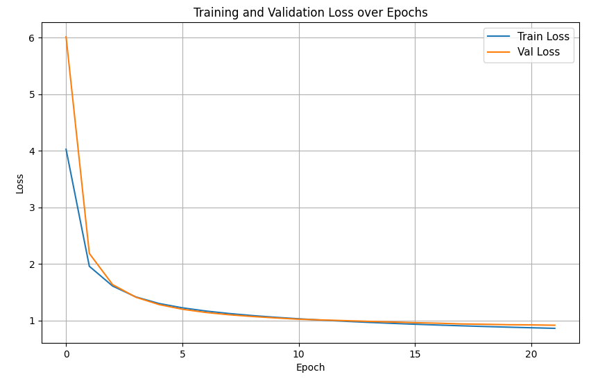

# Attention_Is_All_You_Need

In this repo i tried to reproduce the Transformer from the paper <a href="https://arxiv.org/pdf/1706.03762" target="_blank">Attention_Is_All_You_Need<a> and used it to make some translation from English-to-Italian. The network uses an Encoder-Decoder architecture based solely on attention mechanisms. The commented code for the Transformer can be found in the [model.py](model.py) file.

## Dependencies
```
pip install -r requirements.txt
```

* pytorch
* scikit-learn
* tiktoken

## Encoding
For the text encoding i used the Open Ai's [tiktoken](https://github.com/openai/tiktoken) BPE tokenizer which has a vocabulary size of more than 50K tokens unlike the paper where they used a vocabulary of 32K tokens. The encodings code can be found inside the [utils](utils) directory.

For the encoding procedure we run the following command from the utils directory:

```
python tokenization.py
```

this will create a .pkl file called tokenized_parallel_sentences.pkl inside the data directory that will contain a list of pairs where in the first position of the pair there is the tokenized sentence in the source language (English in my case) and in the second one the tokenized sentence in the target language (Italian).


Example:

-Parallele sentences in the dataset:<br> 
('In the U.S., it is illegal to torture people in order to get information from them.', <br>
 'Negli Stati Uniti è illegale torturare le persone per poter ottenere informazioni da loro.') 
 
 -After tokenization: <br>
 ([818,262,471,13,50,1539,340,318,5293,284,11543,661,287,1502,284,651,1321,422,606,13,50258],
 [32863,4528,5133,72,791,8846,6184,101,4416,1000,7619,333,533,443,2774,505,583,1787,263,267,32407,567,4175,1031,295,72,12379,300,16522,13,50258])


 ## Training

The model can be trained with one gpu: 
```
python train.py
```
but the code also support distributed training. In my case i trained the model on 4 RTX 4090 gpus with the following command:
```
torchrun --standalone --nproc_per_node=4 train.py
```
the --standalone flag is used to indicate that the processes will be located on the same node.

### Model Configuration

I used the base model configuration described in the original paper:


The model configuration can be found in the [config.py](config.py) file where i add the batch size and the max epoch for the training.
I used a batch size of 384 since i used 4 gpus and i wanted to make the most of the available RAM and trained for 22 epochs. The training took almost 3 hours.
Since i used a larger vocabualry size the number of model parameteres is not 65M like in the paper but 95M.


### Dataset
I decided to use the [Europarl Parallel Corpus](https://www.statmt.org/europarl/) Italian-English which is composed by 1,909,115 parallel sentences which is much smaller corpus than the one used in the paper (17M sentences). You can also find the .txt files inside the [data](data) directory.
I used a smaller dataset because for a really large dataset, like the one in the paper, the training would have taken too much time and resources.

### Training Results



The [random_test.py](random_test.py) file can be used to sample senteces from the validation set to see how well the model translates. It takes an argument passed by command line that is the number of senteces to translate. For example:
```
python random_test.py 4
```

That generetas the following output:
```
Prediction: Ultimo, ma non meno importante, come ho detto, è di adottare un approccio comune.
True: L'ultimo punto, ma non per importanza, è, come ho detto, l'adozione di un approccio comune.
Source: Last, but not least, it is important, as I said, to adopt a common approach.

Prediction: (RO) Signora Presidente, dal 2009 la politica commerciale è sotto il mandato esclusivo dell'Unione europea e ora dobbiamo trovare un denominatore comune per una parte esclusiva degli investimenti esteri.
True: (RO) Signora Presidente, dal 2009 la politica commerciale è diventata di competenza esclusiva dell'Unione europea e ora dobbiamo trovare un denominatore comune per una parte cospicua della politica in materia di investimenti esteri.
Source: (RO) Madam President, since 2009, commercial policy has come under the exclusive remit of the European Union and we must now find a common denominator for a large part of foreign investment policy.

Prediction: In secondo luogo, per quanto riguarda la questione della partecipazione del pubblico, onorevole Oettinger, lei ha affermato che non abbiamo bisogno di regolamenti precisi in questo campo.
True: In secondo luogo, per quanto riguarda la partecipazione pubblica, lei, Commissario Oettinger, sostiene che non abbiamo bisogno di regolamenti dettagliati in questo settore.
Source: Secondly, on the issue of public participation, you said, Mr Oettinger, that we do not need detailed regulations in this area.

Prediction: La commercializzazione di medicinali falsificati ha aumentato i rischi per la sanità pubblica.
True: Signor Presidente, la commercializzazione di medicinali contraffatti ha fatto aumentare i rischi per la salute pubblica negli ultimi anni.
Source: The marketing of falsified medicinal products has increased public health risks over recent years.
```

If you know a little bit of italian you will notice that the translations are pretty good and i'm actually satisfied with these results considering the relatively small training.

I also created, with poor results, a [translate.py](translate.py) to see how the model would perform with a sentence chosen by the user. After running this command:
```
python translate.py
```
it will ask to enter a sentence that will be translated, for example:
```
Enter a sentence: My name is Marco and i am Italian.
My name is Marco and i am Italian.
Il mio nome è e sono l'unico a chiamarlo: "Sono Marco Polo".
```

The translation this time is totally wrong and this is due to the fact that the model has been trained on dataset that consists of parliamentary proceedings. This dataset is heavily skewed towards formal, political, and legislative language so it struggles with simple sentences like the one in the example.


